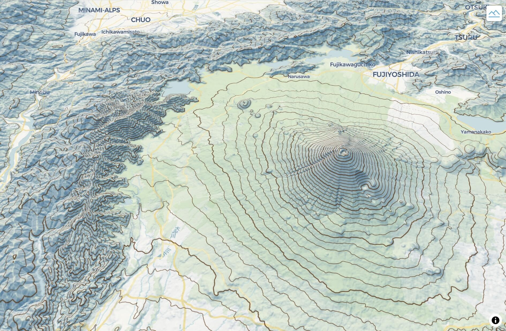

# Rendering isolines with maplibre-contour and GSI Japan Elevation Tiles

A small demo showcasing isoline rendering with [maplibre-contour](https://github.com/onthegomap/maplibre-contour) and [国土地理院標高タイル](https://maps.gsi.go.jp/development/ichiran.html#dem).

Demo: https://maplibre-gsi-contour-demo.pages.dev/

---

- [MapLibre GL JS](https://maplibre.org/maplibre-gl-js/docs/)
  - [Svelte MapLibre GL](https://svelte-maplibre-gl.mierune.dev/)
- [maplibre-contour](https://github.com/onthegomap/maplibre-contour)
- [国土地理院標高タイル (GSI Japan Elevation Tiles)](https://maps.gsi.go.jp/development/ichiran.html#dem)
- [SvelteKit](https://svelte.dev/)

